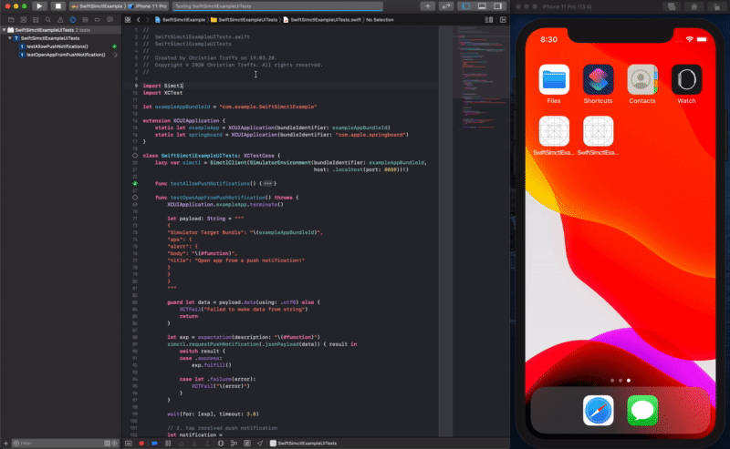
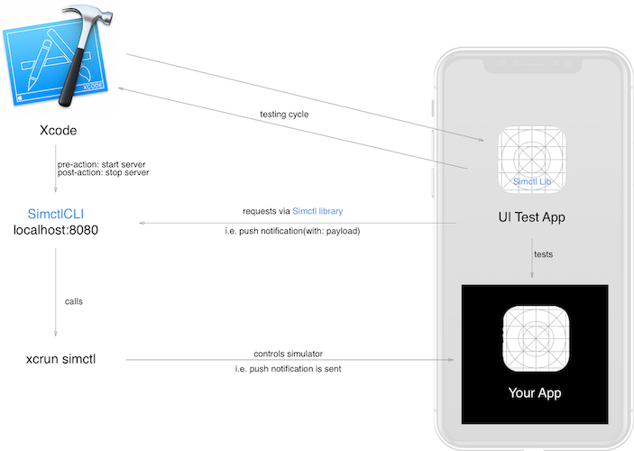
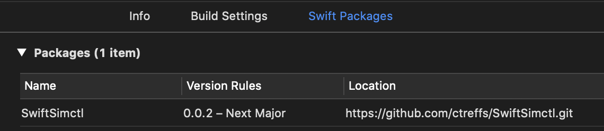

# Swift Simctl

[](https://github.com/ctreffs/SwiftSimctl/actions)
[](https://github.com/ctreffs/SwiftSimctl/blob/master/LICENSE)
[](https://swift.org/download)
[](#)

<p align="center">
	
</p>   


This is a small tool (SimctlCLI) and library (Simctl), written in Swift, to automate [`xcrun simctl`](https://developer.apple.com/library/archive/documentation/IDEs/Conceptual/iOS_Simulator_Guide/InteractingwiththeiOSSimulator/InteractingwiththeiOSSimulator.html#//apple_ref/doc/uid/TP40012848-CH3-SW4) commands for Simulator in unit and UI tests.

It enables, among other things, reliable **fully automated** testing of Push Notifications with dynamic content, driven by a UI Test you control.

### 🚧 Architecture

<p align="center">
	<a href="docs/Overview.png" target="_blank"></a>
</p>

Swift Simctl is made of two parts. `SimctlCLI` and `Simctl`.

`Simctl` is a Swift library that can be added to your project's test bundles. 
It provides an interface to commands that are otherwise only available via `xcrun simctl` from within your test code.
To enable calling these commands `Simctl` communicates over a local network connection to `SimctlCLI`.

`SimctlCLI` is a small command line tool that starts a local server, listens to requests from `Simctl` (the client library) and executes `xcrun simctl` commands.

### ⌨ Available Commands

The following commands will be available in code in your (test) targets:

- Send push notifications with custom payload
- Grant or revoke privacy permissions (i.e. camera, photos ...)
- Set the device UI appearance to light or dark mode
- Set status bar overrides (i.e. data network, time ...)
- Uninstall app by bundle id
- Terminate app by bundle id
- Rename device
- Trigger iCloud Sync

## ❔ Why would you (not) use this

#### ➕ Pro

- Closed system (Mac with Xcode + Simulator)
- No external dependencies on systems like [APNS](https://developer.apple.com/library/archive/documentation/NetworkingInternet/Conceptual/RemoteNotificationsPG/APNSOverview.html)
- No custom test code bloating your code base (AppDelegate) unnecessarily
- Push notifications can be simulated properly and the normal app cycle is preserved
- Runs on CI machines
- Your app stays a black box and does not need to be modified

#### ➖ Contra

- Needs a little configuration in your Xcode project
- Only available for Xcode 11.4+

For specific usage please refer to the example projects **[Swift Simctl Package Example](https://github.com/ctreffs/SwiftSimctlExample)** or **[Swift Simctl Cocoapod Example](https://github.com/ctreffs/SwiftSimctlExample)**

## 🚀 Getting Started

These instructions will get your copy of the project up and running on your machine.

### 📋 Prerequisites

- [Xcode 11.4](https://developer.apple.com/documentation/xcode_release_notes/) and higher.
- [Swift Package Manager (SPM)](https://github.com/apple/swift-package-manager) or [Cocoapods](https://cocoapods.org)

### 💻 Usage

### 📦 Swift Package

To use Swift Simctl in your Xcode project add the package:

1. Xcode > File > Swift Packages > Add Package Dependency...
2. Choose Package Repository > Search: `SwiftSimctl` or find `https://github.com/ctreffs/SwiftSimctl.git`
3. Select  `SwiftSimctl` package > `Next` 
4. Do not forget to add the dependency to your (test) target
5. Use `import Simctl` to access the library in your (test) target.

#### Running the server alongside your tests

Ensure that for the duration of your test run `SimctlCLI` runs on your host machine.
To automate that with Xcode itself use the following snippets as pre and post action of your test target.

###### `Your Scheme` > Test > Pre-Actions > Run Script

```sh
#!/bin/bash
killall SimctlCLI # cleaning up hanging servers
set -e # fail fast
# start the server non-blocking from the checked out package
${BUILD_ROOT}/../../SourcePackages/checkouts/SwiftSimctl/bin/SimctlCLI start-server > /dev/null 2>&1 &
```

###### `Your Scheme` > Test > Post-Actions > Run Script

```sh
#!/bin/bash
set -e
killall SimctlCLI

```

###### 📝 Code Example Swift Package

Please refer to the example project for an in depth code example **<https://github.com/ctreffs/SwiftSimctlExample>**


### ☕ Cocoapod

Assuming you have a project with Cocoapods already set up (otherwise refer to [these instructions](https://guides.cocoapods.org/using/using-cocoapods.html)):

1. Add `pod 'Simctl', '~> 0.2.0'` to your (test) target in your `Podfile`
2. Run `pod install`
3. Open `<YourProject>.xcworkspace`

#### Running the server alongside your tests

nsure that for the duration of your test run `SimctlCLI` runs on your host machine.
To automate that with Xcode itself use the following snippets as pre and post action of your test target.

###### `Your Scheme` > Test > Pre-Actions > Run Script

```sh
#!/bin/bash
killall SimctlCLI # cleaning up hanging servers
set -e # fail fast
# start the server non-blocking from the checked out pod
${PODS_ROOT}/Simctl/bin/SimctlCLI start-server > /dev/null 2>&1 &

```

###### `Your Scheme` > Test > Post-Actions > Run Script

```sh
#!/bin/bash
set -e
killall SimctlCLI

```

###### 📝 Code Example Cocoapod

Please refer to the example project for an in depth code example **<https://github.com/ctreffs/SwiftSimctlExamplePod>**


## 🙏 Kudos

Swift Simctl would not be possible without these awesome libraries:

- [ShellOut](https://github.com/JohnSundell/ShellOut) - easy command line invocations
- [Swifter](https://github.com/httpswift/swifter) - a tiny http server

## ✍️ Authors

* [Christian Treffs](https://github.com/ctreffs)

See also the list of [contributors](https://github.com/ctreffs/SwiftSimctl/graphs/contributors) who participated in this project.

## 🔏 Licenses

This project is licensed under the MIT License - see the [LICENSE](https://github.com/ctreffs/SwiftSimctl/blob/master/LICENSE) file for details.
